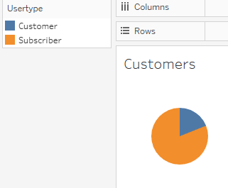
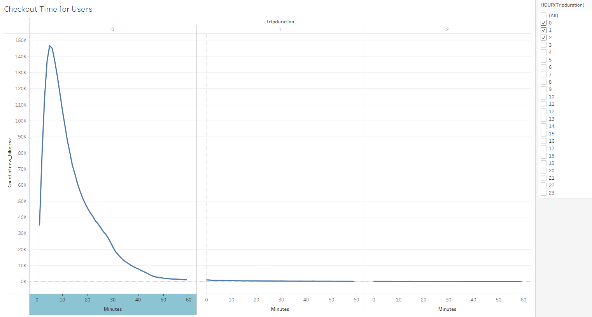
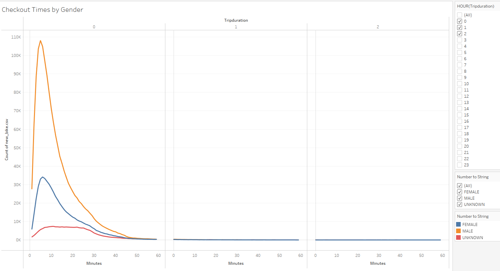
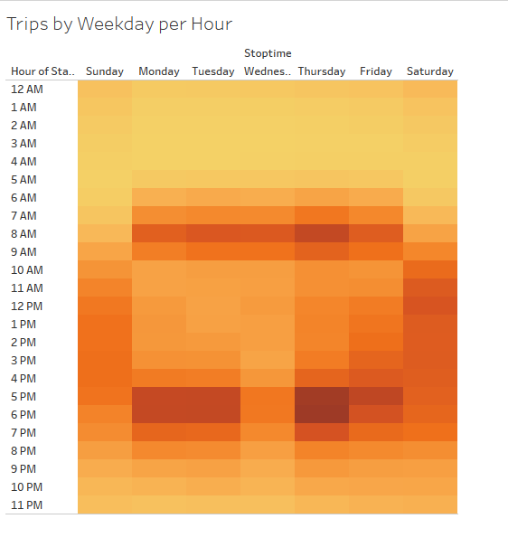
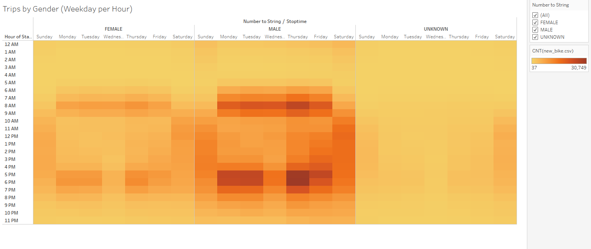
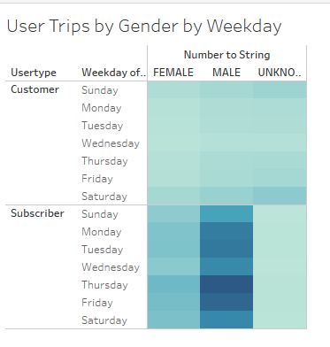

# Bike Sharing

## Overview of analysis

We were given the task of seeing how the Citibike sharing worked in New York City
during the month of August.  We are hoping to bring the same Citibike sharing to
the city of Des Moines, Iowa.  We picked the month of August as this is a great
time in the city of New York since it's in the heart of summer and we can see
just how popular the bikes are in the city.

## Results

The first item we looked at was who are our users?  We checked to see how 
many users were subscribers to the Citibike service and who was just a 
regular customer.  As we see in the chart below most of our users in
NYC are subscribers.

The next item we looked after the subscribers is what gender uses the 
bikes the most.  It shows that the majority of our users are male with
over 1.5 million users that were male.  We still do show over 200,000
users that are of unknown gender while the female users number over 
580,000

We then reviewed how long the bikes were used.  When review the chart below we 
can see that most trips are pretty quick, between 5 to 20 minutes long.

As we showed in the pie chart the majority of our users are male as we can see
by the same line graph we did before showing the duration of use but here
we see that males are the ones that mostly use the bikes for 5-20 minutes.

Our next item is a heat map of the most popuular times to use the bikes.
As we can see here the most popular times during the week are times usually
reserved for commuting to work.  7-9 AM and 5-7 PM.  We can also see on the
weekends it's basically an all day popular item to use.

We next looked at another heat map but this time breaking down by gender.
These still show what our original heatmap showed, the hours that are most
popular for both genders is the commuting time to and from work.

Lastly we did one last heatmap between our subscribers and regular customers 
and further break it down by gender.  It shows our main subscriber is a male
but also shows that our strong subscriber base is what is making Citibike
the most money.

## Summary

After we reviewed this data it does seem very possible that we could bring
Citibike to Iowa.  There are a couple items though that we could try to 
visualize and that would be the cooler months in the fall and spring. 
If we could do another analysis based on the month of April and October
this may give us more data to see if it's possible to bring this to Iowa.
The positive with NYC is that yes there are a ton of subscribrers but
also a ton of tourist that may be using these bikes as well. So if there
would be a way to get data showing if the users are first time users that
may give us glimpse on how much NYC relied on their tourists.  Iowa isn't
a true destination so that is what we'd liek to see, if most of their
customer base is still regular users but not subscribers that may show
that this is feasible and would make money in Des Moines.  

[link to dashboard](https://public.tableau.com/views/IowaBike/CheckoutTimesbyGender?:language=en-US&:display_count=n&:origin=viz_share_link)

